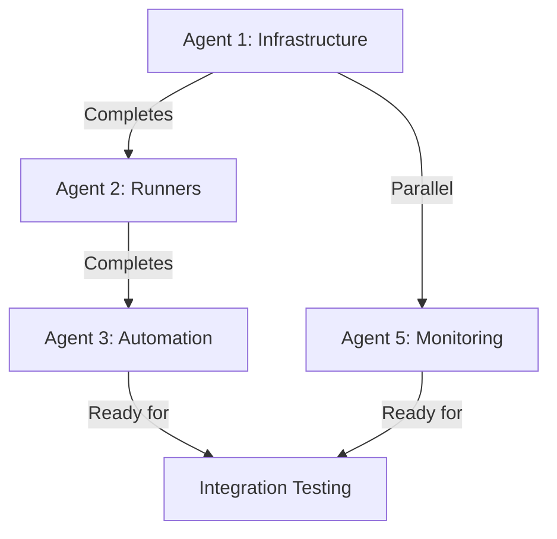
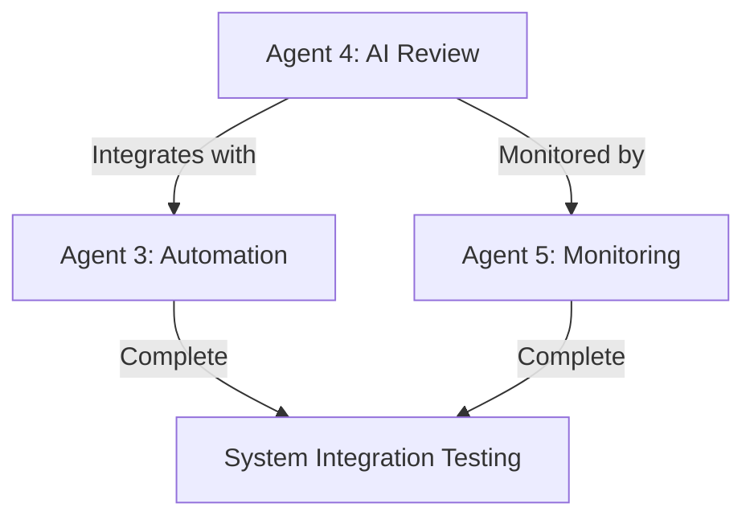

# Self-Hosted CI/CD Infrastructure Project Specification

## 🎯 Project Overview

**Repository Name**: `embeddenator-ci-infrastructure`

**Purpose**: A self-hosted, containerized CI/CD platform with automated code review, formatting, linting, and intelligent test execution. Designed to run on workstation hardware with GPU acceleration support, resource management, and both ephemeral and persistent deployment modes.

**Hardware Target**: Intel 14700K (20 cores), 48GB DDR5, NVIDIA RTX 5080

---

## 📋 Repository Initialization

### GitHub Repository Creation

```bash
# Using GitHub CLI
gh repo create embeddenator-ci-infrastructure \
  --public \
  --description "Self-hosted CI/CD platform with automated code review, GitHub ARC runners, and GPU acceleration" \
  --gitignore "Docker,Python,Go" \
  --license "MIT" \
  --add-readme

# Clone
gh repo clone embeddenator-ci-infrastructure
cd embeddenator-ci-infrastructure
```

### Or manually create with this README:

```markdown
# embeddenator-ci-infrastructure

Self-hosted CI/CD platform featuring:
- GitHub Actions ARC (Actions Runner Controller) integration
- Automated code formatting and linting with auto-fix PRs
- AI-powered code review (Sourcery AI + Copilot fallback)
- Smart notifications (failures/errors only)
- GPU acceleration support (NVIDIA RTX 5080)
- Resource-aware scheduling with ephemeral/persistent modes

## Quick Start
\`\`\`bash
./scripts/setup.sh
./scripts/deploy.sh --mode ephemeral
\`\`\`

See [docs/](docs/) for detailed documentation.
```

---

## 🏗️ Project Structure

```
embeddenator-ci-infrastructure/
├── README.md
├── LICENSE (MIT)
├── .gitignore
├── Makefile
├── ARCHITECTURE.md
├── DEVELOPMENT.md
├── DEPLOYMENT.md
├── CONTRIBUTING.md
│
├── docs/
│   ├── agent-workflows/           # ⚡ Agent guidance documents
│   │   ├── 00-project-context.md  # Full project context
│   │   ├── 01-infrastructure-setup.md
│   │   ├── 02-arc-integration.md
│   │   ├── 03-autofix-workflow.md
│   │   ├── 04-ai-review.md
│   │   ├── 05-monitoring.md
│   │   └── 06-cross-platform.md
│   ├── deployment-guides/
│   │   ├── linux-debian-ubuntu.md
│   │   ├── windows-wsl2.md
│   │   └── macos.md
│   └── api-reference.md
│
├── docker/
│   ├── docker-compose.yml
│   ├── docker-compose.ephemeral.yml
│   ├── docker-compose.persistent.yml
│   ├── runner/
│   │   ├── Dockerfile
│   │   └── entrypoint.sh
│   ├── code-review/
│   │   ├── Dockerfile
│   │   └── config/
│   ├── webhook-server/
│   │   ├── Dockerfile
│   │   └── config/
│   └── monitoring/
│       ├── prometheus/
│       └── grafana/
│
├── services/
│   ├── runner-manager/        # Go
│   │   ├── main.go
│   │   ├── go.mod
│   │   ├── cmd/
│   │   ├── pkg/
│   │   └── internal/
│   ├── autofix-bot/            # Python
│   │   ├── main.py
│   │   ├── requirements.txt
│   │   ├── pyproject.toml
│   │   └── autofix_bot/
│   ├── review-orchestrator/    # Python
│   │   ├── main.py
│   │   ├── requirements.txt
│   │   └── review_orchestrator/
│   └── notification-service/   # Python
│       ├── main.py
│       ├── requirements.txt
│       └── notification_service/
│
├── config/
│   ├── runner-config.yaml
│   ├── resource-limits.yaml
│   ├── notification-rules.yaml
│   └── cost-thresholds.yaml
│
├── scripts/
│   ├── setup.sh
│   ├── deploy.sh
│   ├── health-check.sh
│   └── cleanup.sh
│
├── tests/
│   ├── unit/
│   ├── integration/
│   └── e2e/
│
└── .github/
    ├── workflows/
    │   ├── build-images.yml
    │   ├── test.yml
    │   └── release.yml
    └── ISSUE_TEMPLATE/
```

---

## 🤖 Agent Development Workflow

### Multi-Agent Implementation Strategy

This project uses a **coordinated multi-agent workflow** where specialized agents handle different aspects of the system.

### Agent Roles

#### **Agent 1: Infrastructure Architect** 
**Focus**: Docker, networking, resource management

**Tasks**:
- Design Docker Compose configurations (base, ephemeral, persistent)
- Configure resource limits (CPU, memory, GPU)
- Set up Docker networks and volumes
- Implement health checks and readiness probes
- Configure monitoring infrastructure (Prometheus, Grafana)

**Deliverables**:
- `docker/docker-compose*.yml`
- `config/resource-limits.yaml`
- `docker/monitoring/`
- Health check scripts

**Guidance Document**: `docs/agent-workflows/01-infrastructure-setup.md`

---

#### **Agent 2: Runner Integration Specialist**
**Focus**: GitHub ARC, runner management, auto-registration

**Tasks**:
- Implement GitHub Actions ARC integration
- Build runner auto-registration system
- Develop runner lifecycle management (start, stop, scale)
- Create platform-specific runner configurations
- Implement runner health monitoring

**Deliverables**:
- `services/runner-manager/` (Go service)
- `docker/runner/` (Runner Docker image)
- `config/runner-config.yaml`
- Runner registration automation

**Guidance Document**: `docs/agent-workflows/02-arc-integration.md`

---

#### **Agent 3: Automation Workflow Engineer**
**Focus**: Auto-fix PRs, formatting, linting automation

**Tasks**:
- Build auto-fix PR bot for formatting/linting
- Implement cargo fmt, clippy automation for Rust
- Add Python (black, isort, pylint) support
- Create PR creation and update logic
- Implement CI result caching and reuse
- Build workflow state machine

**Deliverables**:
- `services/autofix-bot/` (Python service)
- PR automation logic
- CI result cache
- Workflow orchestration

**Guidance Document**: `docs/agent-workflows/03-autofix-workflow.md`

---

#### **Agent 4: AI Integration Developer**
**Focus**: Sourcery AI, Copilot, review orchestration

**Tasks**:
- Integrate Sourcery AI API (primary review)
- Implement GitHub Copilot fallback
- Build 10-minute timeout with emoji status tracking
- Parse and normalize review results
- Implement auto-merge logic with review requirements
- Handle review failures and retries

**Deliverables**:
- `services/review-orchestrator/` (Python service)
- Sourcery AI integration
- Copilot fallback chain
- Review result parser
- Auto-merge logic

**Guidance Document**: `docs/agent-workflows/04-ai-review.md`

---

#### **Agent 5: Notification & Monitoring Specialist**
**Focus**: Smart notifications, cost tracking, observability

**Tasks**:
- Build smart notification system (failures/errors only)
- Implement email service integration (SMTP)
- Create cost tracking for billable events
- Build Grafana dashboards
- Implement structured logging
- Create alert rules

**Deliverables**:
- `services/notification-service/` (Python service)
- Email templates
- Cost tracking module
- Grafana dashboards
- Alert configurations

**Guidance Document**: `docs/agent-workflows/05-monitoring.md`

---

#### **Agent 6: Cross-Platform Engineer** (Phase 2)
**Focus**: Windows, macOS support

**Tasks**:
- Implement Windows WSL2 compatibility
- Add macOS support
- Create platform-specific deployment scripts
- Build compatibility layer
- Test cross-platform deployments

**Deliverables**:
- Windows deployment scripts
- macOS deployment scripts
- Platform compatibility layer
- Cross-platform tests

**Guidance Document**: `docs/agent-workflows/06-cross-platform.md`

---

## 🔄 Agent Workflow Sequence

### Phase 1: Foundation (Weeks 1-4)



**Week 1-2**: Agent 1 (Infrastructure)
- Docker Compose setup
- Resource limits
- Networking
- Health checks

**Week 2-3**: Agent 2 (Runners) + Agent 5 (Monitoring - parallel)
- ARC integration
- Runner management
- Basic monitoring

**Week 3-4**: Agent 3 (Automation)
- Auto-fix bot
- PR creation
- CI caching

### Phase 2: Intelligence (Weeks 5-8)



**Week 5-6**: Agent 4 (AI Integration)
- Sourcery AI
- Copilot fallback
- Review orchestration

**Week 7-8**: Integration & Optimization
- End-to-end workflow testing
- Performance tuning
- Cost optimization

### Phase 3: Expansion (Weeks 9-12)

**Week 9-12**: Agent 6 (Cross-Platform)
- Windows support
- macOS support
- Final testing

---

## 📐 Technical Architecture

### System Overview

```
┌─────────────────────────────────────────────────────────────┐
│                    Host System (14700K)                      │
│  ┌─────────────────────────────────────────────────────────┐│
│  │           Docker Compose Orchestration                   ││
│  │                                                          ││
│  │  ┌──────────────┐  ┌──────────────┐  ┌──────────────┐ ││
│  │  │   Runner     │  │   Autofix    │  │   Review     │ ││
│  │  │   Manager    │  │     Bot      │  │ Orchestrator │ ││
│  │  │    (Go)      │  │   (Python)   │  │   (Python)   │ ││
│  │  │              │  │              │  │   + GPU      │ ││
│  │  │  4 cores     │  │  2 cores     │  │  4 cores     │ ││
│  │  │  8GB RAM     │  │  4GB RAM     │  │  8GB + 8GB   │ ││
│  │  │              │  │              │  │    VRAM      │ ││
│  │  └──────────────┘  └──────────────┘  └──────────────┘ ││
│  │                                                          ││
│  │  ┌──────────────┐  ┌──────────────┐  ┌──────────────┐ ││
│  │  │  ARC Runner  │  │  ARC Runner  │  │ Notification │ ││
│  │  │   Instance   │  │   Instance   │  │   Service    │ ││
│  │  │    (x2)      │  │    (x2)      │  │   (Python)   │ ││
│  │  │              │  │              │  │              │ ││
│  │  │  4 cores ea  │  │  4 cores ea  │  │  2 cores     │ ││
│  │  │  8GB RAM ea  │  │  8GB RAM ea  │  │  4GB RAM     │ ││
│  │  └──────────────┘  └──────────────┘  └──────────────┘ ││
│  │                                                          ││
│  │  ┌──────────────────────────────────────────────────┐  ││
│  │  │         Monitoring Stack (Prometheus+Grafana)    │  ││
│  │  │              2 cores, 4GB RAM                     │  ││
│  │  └──────────────────────────────────────────────────┘  ││
│  └─────────────────────────────────────────────────────────┘│
└─────────────────────────────────────────────────────────────┘

Total Allocated: 20 cores, 40GB RAM, 8GB VRAM
Host Reserved: 8 cores, 8GB RAM (for desktop use)
```

### Resource Allocation

```yaml
# config/resource-limits.yaml
services:
  runner-manager:
    cpus: 4.0
    memory: 8Gi
    
  autofix-bot:
    cpus: 2.0
    memory: 4Gi
    
  review-orchestrator:
    cpus: 4.0
    memory: 8Gi
    devices:
      - driver: nvidia
        count: 1
        capabilities: [gpu]
    gpu_memory: 8Gi  # Half of RTX 5080
    
  arc-runner:
    cpus: 4.0
    memory: 8Gi
    replicas: 2
    
  notification-service:
    cpus: 2.0
    memory: 4Gi
    
  monitoring:
    cpus: 2.0
    memory: 4Gi
```

---

## 🔐 Security & Secrets Management

### Secrets Storage

```bash
# Docker secrets (preferred)
echo "ghp_xxxxxxxxxxxxx" | docker secret create github_token -
echo "sourcery_api_key_xxx" | docker secret create sourcery_api_key -

# Environment variables (.env - never commit!)
GITHUB_APP_ID=123456
GITHUB_INSTALLATION_ID=78910
SOURCERY_API_KEY=sk_xxx
SMTP_PASSWORD=xxx
```

### GitHub App Permissions

**Required Permissions**:
- **Contents**: Read & Write (for auto-fix PRs)
- **Pull Requests**: Read & Write (for PR creation/updates)
- **Checks**: Read & Write (for status checks)
- **Actions**: Read (for runner registration)
- **Metadata**: Read (repository information)

---

## 💰 Cost Tracking & Optimization

### Billable Event Classification

```python
# services/notification-service/cost_tracker.py
BILLABLE_EVENTS = {
    'github_actions_minutes': {
        'linux': 0.008,      # $0.008/min
        'windows': 0.016,    # $0.016/min  
        'macos': 0.08        # $0.08/min
    },
    'github_storage': {
        'artifacts_gb_month': 0.25  # $0.25/GB-month
    },
    'external_api_calls': {
        'sourcery_review': 0.001    # Estimate
    }
}
```

### Notification Rules

```yaml
# config/notification-rules.yaml
triggers:
  always:
    - build_failure
    - deployment_failure
    - security_alert
    - cost_threshold_exceeded
    
  threshold_based:
    cost_daily:
      threshold: 5.00  # $5/day
      notify: email
    
    duration:
      threshold: 600   # 10 minutes
      notify: webhook
    
  never:
    - build_success
    - pr_created
    - pr_updated
    - runner_started
```

---

## 📊 Monitoring & Observability

### Metrics Collection

**System Metrics**:
- CPU/Memory/GPU utilization per container
- Disk I/O and network throughput
- Container health and restart counts

**CI/CD Metrics**:
- Job queue length and wait times
- Build duration by architecture
- Success/failure rates
- Test execution time

**Automation Metrics**:
- Auto-fix PR creation rate
- Review turnaround time
- Auto-merge success rate
- Cost per build

### Grafana Dashboards

1. **System Overview**
   - Resource utilization heatmap
   - Container health status
   - GPU utilization (RTX 5080)

2. **CI Pipeline**
   - Job queue visualization
   - Build duration trends
   - Success rate by project

3. **Cost Tracking**
   - Daily/weekly/monthly costs
   - Cost breakdown by service
   - Projected monthly spend

4. **Review Analytics**
   - Review source distribution
   - Approval rates
   - Avg review time

---

## 🧪 Testing Strategy

### Test Pyramid

```
              /\
             /  \     E2E (10%)
            /    \    Full workflow validation
           /------\
          /        \  Integration (30%)
         /          \ Service interactions
        /            \
       /______________\ Unit (60%)
                        Individual components
```

### Test Commands

```bash
# Unit tests
make test-unit

# Integration tests (requires Docker)
make test-integration

# E2E tests (requires full deployment)
make test-e2e

# All tests
make test
```

---

## 🚀 Deployment Modes

### Ephemeral Mode

**Use Case**: Testing, development, one-off builds

```bash
./scripts/deploy.sh --mode ephemeral

# Characteristics:
# - No persistent volumes (except config)
# - Automatic cleanup on shutdown
# - Fresh state each deployment
# - Fast startup (~30 seconds)
```

### Persistent Mode

**Use Case**: Production, long-running workloads

```bash
./scripts/deploy.sh --mode persistent

# Characteristics:
# - Persistent volumes for logs, cache, models
# - State preserved across restarts
# - Incremental updates
# - Backup integration
# - Slower startup (~2 minutes)
```

---

## 📚 Agent Context Documents

Each agent has a dedicated guidance document in `docs/agent-workflows/` that includes:

1. **Project Context**: Full system overview and goals
2. **Agent Responsibilities**: Specific tasks and deliverables
3. **Technical Requirements**: APIs, libraries, patterns to use
4. **Integration Points**: How to integrate with other agents' work
5. **Testing Requirements**: Unit, integration, E2E test expectations
6. **Code Examples**: Starter code and patterns
7. **Success Criteria**: Definition of done for this agent

### Context Document Template

```markdown
# Agent [N]: [Role Name]

## Project Context
[Brief overview of full project]

## Your Responsibilities
[What this agent is responsible for]

## Prerequisites
[What needs to be complete before starting]

## Technical Stack
[Languages, libraries, tools to use]

## Deliverables
- [ ] Item 1
- [ ] Item 2
- [ ] Item 3

## Integration Points
[How to integrate with other services]

## Code Patterns
[Example code and patterns to follow]

## Testing Requirements
[Tests to write]

## Success Criteria
[Definition of done]

## Handoff to Next Agent
[What next agent needs from this work]
```

---

## 🗓️ Project Timeline

### Milestone 1: MVP (Week 4) ✅
- Docker Compose orchestration
- Basic ARC runner
- Auto-fix bot (Rust only)
- Simple notifications

### Milestone 2: Intelligence (Week 8) ✅
- Sourcery AI integration
- Copilot fallback
- Auto-merge logic
- Cost tracking

### Milestone 3: Production (Week 12) ✅
- Full monitoring
- Cross-platform support
- Complete documentation
- Production deployment

### Future Enhancements
- Multi-node cluster
- Kubernetes migration
- Advanced GPU scheduling
- Custom runner images

---

## 📖 Additional Documentation

- **[ARCHITECTURE.md](ARCHITECTURE.md)**: Detailed system architecture
- **[DEVELOPMENT.md](DEVELOPMENT.md)**: Development workflow and guidelines
- **[DEPLOYMENT.md](DEPLOYMENT.md)**: Deployment instructions
- **[CONTRIBUTING.md](CONTRIBUTING.md)**: Contribution guidelines
- **[docs/api-reference.md](docs/api-reference.md)**: API documentation

---

## 🤝 Contributing

Contributions welcome! See [CONTRIBUTING.md](CONTRIBUTING.md) for:
- Development setup
- Code style guidelines
- PR process
- Testing requirements

---

## 📄 License

MIT License - See [LICENSE](LICENSE)

---

## 📞 Support

- **Issues**: https://github.com/tzervas/embeddenator-ci-infrastructure/issues
- **Discussions**: https://github.com/tzervas/embeddenator-ci-infrastructure/discussions

---

**Status**: 📋 Specification Complete - Ready for Implementation

**Version**: 1.0.0

**Last Updated**: 2025-12-16

---

## Quick Start for Repository Creation

1. **Create repository** using GitHub CLI or web interface
2. **Copy this file** to repository root as `README.md`
3. **Run initial setup**:
   ```bash
   git clone https://github.com/tzervas/embeddenator-ci-infrastructure.git
   cd embeddenator-ci-infrastructure
   mkdir -p docs/agent-workflows services/runner-manager services/autofix-bot
   cp docs/SELF_HOSTED_CI_PROJECT_SPEC.md README.md
   git add .
   git commit -m "Initial project specification"
   git push
   ```
4. **Begin Phase 1** with Agent 1 (Infrastructure Architect)
